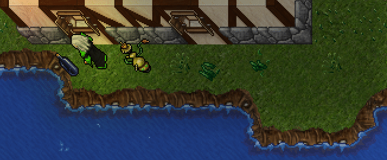

<h1>Seja Bem-Vindo(a)</h1>

  

<a>
♜♞♝♚♛♝♞♜ 
♟♟♟♟♟♟♟♟ 
▓░▓░▓░▓░▓░▓░ 
░▓░▓░▓░▓░▓░▓ 
▓░▓░▓░▓░▓░▓░ 
░▓░▓░▓░▓░▓░▓ 
♙♙♙♙♙♙♙♙ 
♖♘♗♔♕♗♘♖ 

</a>

<i>Fique a vontade para acessar meus repositórios, se tiver alguma dúvida pode me chamar pelo e-mail: <a href='mailto:st3lz3r@duck.com'>st3lz3r@duck.com</a>, ou abrir um merge request que logo lhe respondo...</i>  
<b>Não se esqueça de acessar meu <a href='http://st3lz3r.xxx.nom.br:8080/'>site</a> e criar sua conta !!!<b>

<!--
**st3lz3r/st3lz3r** is a ✨ _special_ ✨ repository because its `README.md` (this file) appears on your GitHub profile.

Here are some ideas to get you started:

- 🔭 I’m currently working on ...
- 🌱 I’m currently learning ...
- 👯 I’m looking to collaborate on ...
- 🤔 I’m looking for help with ...
- 💬 Ask me about ...
- 📫 How to reach me: ...
- 😄 Pronouns: ...
- ⚡ Fun fact: ...
-->
